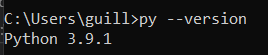
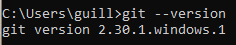
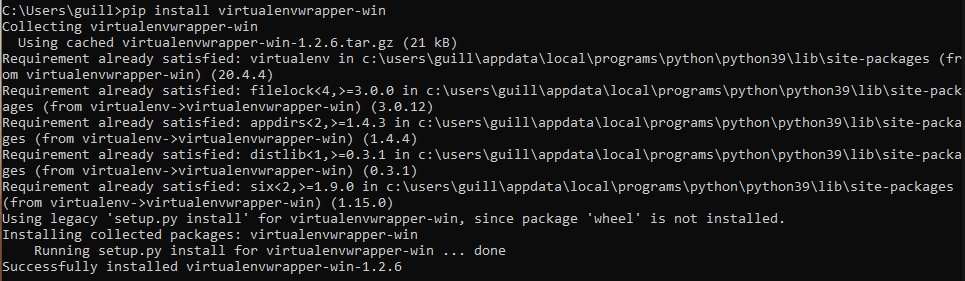
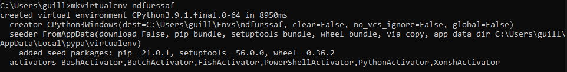
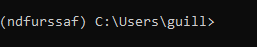
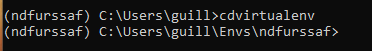
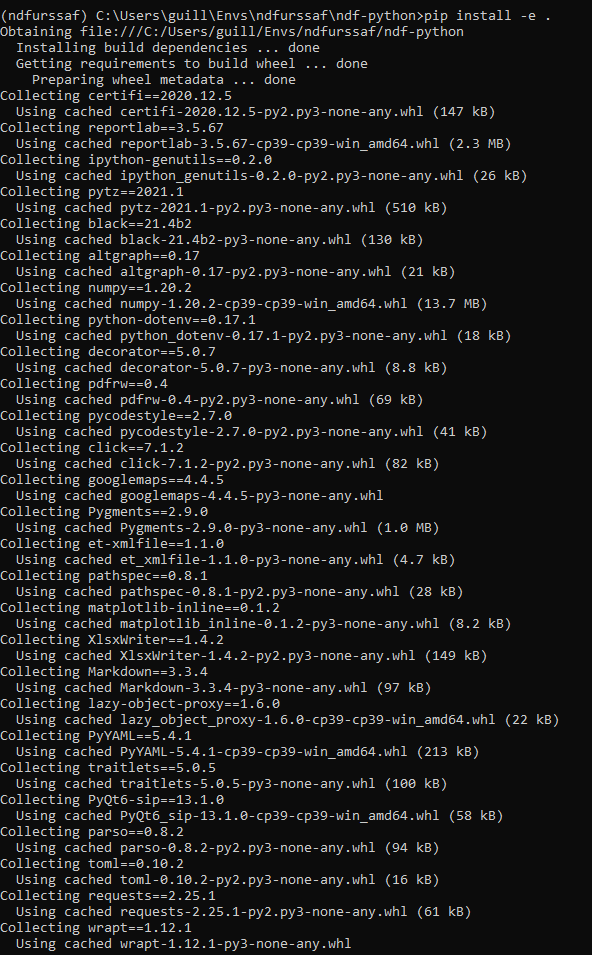
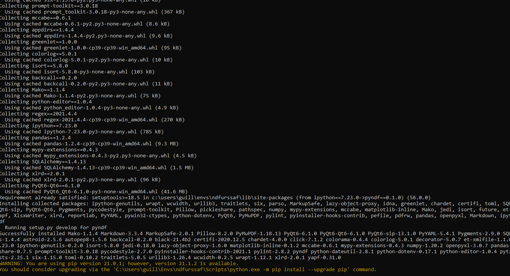
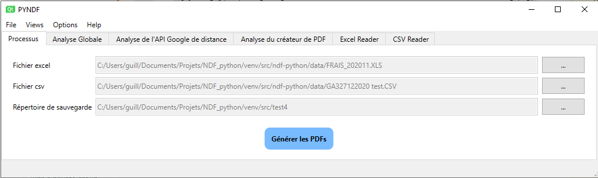

# Manuel de l'application NDF python

## Contenu de cet article

**[Installation](#installation)**  
**[Lancement de l'application](#lancement_app)**  
**[Lancement de l'algorithme](#lancement_algo)**  
**[Visualisation des résultats](#resultats)**  
**[Bonus](#bonus)**

## Installation 

1. [Télécharger python version 3.9.1](https://www.python.org/downloads/release/python-391/). Pour vérifier:
    <!--  -->

1. [Télécharger git](https://git-scm.com/downloads). Pour vérifier:
    <!--  -->

3. Installation de la libraire d'environnement virtuel virtualenvwrapper-win via pip avec la commande *"pip install --user -U virtualenvwrapper-win"*.
    <!--  -->

4. Création d'un environnement virtuel avec la commande *"mkvirtualenv ndfurssaf"*. Le programme activera automatiquement l'environnement. 
    <!--  -->
    <!--  -->

5. Déplacement dans le répertoire de l'environnement virtuel avec la commande *"cdvirtualenv"*. 
    <!--  -->

6. Récupération de dépôt git depuis github avec la commande *"git clone https://github.com/Guillaume-Guardia/ndf-python"* . 
    <!-- -->

7. Installation des dépendances liées au projet ndf-python avec la commande *"pip install -e ."*
    <!--  -->
    <!--  -->

8. Enregistrement de l'environnement dans les variables d'environnements Windows avec la commande *"set NDF_ENV=ndfurssaf"* 

9. Créer un raccourci du fichier ndf.exe
    <!--  -->

## Lancement de l'application 

Il existe manière de démarrer l'application:
* Par la ligne de commande *"py src/pyndf/main.py [-h] [--log {NOTSET, DEBUG, INFO, WARN, ERROR, CRITICAL}] [-e EXCEL] [-c CSV] [-o OUTPUT] [-l LANGUAGE]"* à la racine du dépôt git. Il faut s'assurer d'avoir activer l'environnement virtuel avant d'exécuter la commande. Pour activer l'environnement virtuel, il suffit de lancer la commande *"workon ndfurssaf"*. Pour se rendre à la racine du dépôt git, taper la commande *"cdvirtualenv & cd ndf-python"*.
Explications des arguments facultatifs optionnels:
  + -h, --help: Montre la liste des options.
  + --log {NOTSET, DEBUG, INFO, WARN, ERROR, CRITICAL}: Niveau des logs affichés
  + -e EXCEL, --excel EXCEL: Fichier Excel à utiliser
  + -c CSV, --csv CSV: Fichier CSV à utiliser
  + -o OUTPUT, --output OUTPUT: Le répertoire de sauvegarde
  + -l LANGUAGE, --language LANGUAGE: Sélection de la langue de l'application (en ou fr)
* Par le fichier ndf.bat en double cliquant sur l'icone.
* Par le fichier ndf.exe en double-cliquant sur l'icone.
* En créant un raccourci sur le fichier ndf.bat ou ndf.exe, et en double cliquant dessus.

L'ensemble des façons va ouvrir la fenêtre de l'application prête à être utiliser.

  <!--  -->

## Lancement de l'algorithme 

Pour lancer l'algorithme depuis l'interface utilisateur graphique, il suffit de cliquer sur le bouton destiné à générer les fichiers PDF au centre de l'onglet processus. Il faut, bien entendu avoir préalablement renseigné les différents paramètres qui sont:
* le fichier EXCEL (fichier avec l'extension correspondant à une des expressions régulières  \*.xl\* et \*. XLS)
* le fichier CSV issue de la base de données
* le répertoire de sauvegarde

Si toutes les conditions sont réunis, on peut cliquer sur le bouton pour démarrer l'algorithme. Cela va faire apparaître la barre de statut d'exécution (un message, un bouton *Annuler* qui va stopper l'exécution de l'algorithme, et une barre de progression).

### 1ère étape: Lecture du fichier EXCEL

L'algorithme va passer en revue chaque ligne non vide du fichier EXCEL renseigné. Chaque ligne avec un libellé correspondant à l'expression régulière *.\*DEPLACEMENT.\** sera sélectionné. 
*Astuce: Avant de démarrer l'algorithme, en se rendant dans l'onglet de visualisation du fichier EXCEL, on peut apercevoir les lignes bleues qui vont être sélectionnées durant l'algo.*

### 2ème étape: Lecture du fichier CSV

Comme pour le fichier EXCEL, l'algorithme va déterminer les lignes de données à sélectionner, c'est à dire, les lignes où il y a au moins une indemnité non nulle. 
*Astuce: Comme pour le fichier EXCEL, on peut visualiser avant démarrage du processus, les différentes lignes qui seront sélectionnées par la suite.*

### 3ème étape: Obtention de la distance entre l'adresse du client et l'adresse de l'intervenant:

Cette partie va récupérer la distance que parcoure l'intervenant en allant au travail. Les mesures se basent sur l'API Google Distance Matrix.

### 4ème étape: Création des fichiers PDF

Pour chaque matricule renseigné dans les fichiers CSV et EXCEL, le programme créera une note de frais avec toutes les informations disponibles récupérées précedemment. En l'occurence, pour le fichier EXCEL, toutes les missions effectuées par l'intervenant au cours du mois. L'algorithme calcule automatiquement la distance parcourue par mois. Pour les données recueillis dans le fichier CSV, un simple report de toutes les indemnités non nulles. Les fichiers PDF sont disponibles dans le répertoire de sauvegarde indiqué par l'utilisateur. 

## Visualisation des résultats 

Pour vérifier les résultats de l'algorithme, on peut se rendre dans l'onglet *Analyse Globale*. Pour chaque étape, un statut est indiqué :
* une pastille verte si tout s'est passé comme prévu
* une pastille rouge si un problème a été remonté

Pour plus de simplicité, la ligne totale (la dernière) résume l'ensemble de l'algorithme.

### Distance

On peut vérifier toutes les requêtes de distance dans l'onglet *Analyse de l'API Google*.

### Fichiers PDF

En se rendant dans l'onglet *Analyse des fichiers PDF*, un simple coup d'oeil permet de vérifier pour un matricule donné, le fichier PDF (accessible via le bouton prévu à cet effet), le nombre de missions (nombre de lignes sélectionnées dans le fichier EXCEL + la ligne pour l'agence d'origine si pas déjà existante), le nombre d'indemnités (nombre d'indemnités non nulles trouvées dans le fichier CSV) et le status (rouge ou vert).
Si le statut est illustré par une pastille rouge, un bouton de regénération individuel apparait dans la dernière colonne. Cela va relancer l'algorithme pour ce matricule.

## Bonus 

Il existe un plus grand panel de fonctionalités liés au développement de l'application. Celles-ci sont "cachées" et peuvent être activé avec le l'option *mode developpeur*.
On peut facilement activer/desactiver les fonctionalités suivantes:
* Sauvegarde des fichiers temporaires: En modifiant le fichier EXCEL ou CSV dans les onglets correspondants, on peut sauver le tableau dans un fichier portant le même nom en gardant en tête que l'extension ne sera pas forcément la même.
* Utiliser le multithreading: Pour la création des fichiers PDF, deux méthodes ont été implémentées
* les créations se font les unes après les autres -> simple thread.
* les créations se font les unes pendant les autres (avec une limite de 20 threads au maximum en même temps) -> multithread.
L'utilisation de la deuxième méthode est recommandée puisqu'elle est environ 25% plus rapide que la première méthode.

* Ecraser PDF: Lors de la création de fichier PDF, l'application ne demande pas à l'utilisateur si un fichier portant le même nom existe déjà. Si l'on décoche cette option, l'algorithme ne va alors pas créer de fichier, et passera au suivant.

* Utiliser la DB: On peut desactiver la recherche dans la base de données prévu pour éviter d'utiliser l'API pour des requêtes déjà effectuées. L'utilisation est recommandée mais pas obligatoire.

* Utiliser le CACHE: L'utilisation du cache est recommandée et ne dois pas être décochée pour une bonne raison. Les performances liées à l'utilisation du cache face à l'API Google ou la DB est impressionante: la récupération de la donnée est quasi instantanée.

* Utiliser l'API: Cette option a été ajouté pour le développement et ne doit pas être désactivée.

On peut montrer/cacher tous les onglets implémentés. En particulier, on peut visualiser dans les onglets "DB", tout ce qui a été rajouté dans la base de données.
Le mode développeur ajoutera la durée de chaque tache dans les onglets d'analyse, et précisera son statut. 
