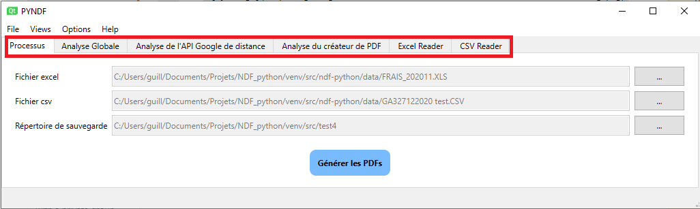

## Installation

01. Télécharger python version 3.9.1 [Download Python](https://www.python.org/downloads/release/python-391/) 
02. Vérification que pip est bien installé -> pip --version
03. pip install virtualenvwrapper-win
04. mkvirtualenv <nom>
05. cdvirtualenv
06. git clone https://github.com/Guillaume-Guardia/ndf-python [package](https://www.python.org/downloads/release/python-391/)
07. pip install -e .
08. set NDF_ENV=<nom>
09. Créer un raccourci du fichier ndf.exe
10. exécuter le raccourci
# Manuel de l'application NDF python

> Fichier descriptif des fonctionnalités de l'application NDF. Celle-ci est composée de vues (onglets) 

 et d'un menu 

. Chaque vue et sous-menu sont décrit dans les paragraphes suivants. 

L'application retient les choix (taille/position de la fenêtre, fichier excel, fichier csv, répertoire de sauvegarde, couleur du tableau de pdf, langue) de l'utilisateur entre deux sessions.

## Vues

> Les vues sont divisées en trois types:
> * le type processus
> * le type analyse
> * le type lecture/écriture

Le widget de status de l'application est affichée sur toutes les vues. Elle est divisée en deux partie: Une partie pour les messages envoyé depuis l'application pour tenir informer l'utilisateur, et l'autre pour la barre de chargement avec indicateur digital à droite.

### Processus

La vue processus est composé de trois ensembles composés d'un texte, d'un edit texte et d'un bouton, puis un bouton centrale qui fait office de starter pour le programme. 
Pour ajouter un fichier à l'application, il faut appuyer sur le bouton de l'ensemble voulu. Une fenêtre de dialogue s'ouvre, il faut alors choisir un fichier correspondant au filtre indiqué en bas à droite (

)

### Vues d'analyse

Trois vues d'analyse ont été implémenté pour le moment. Dans chaque vue, on peut retrouver des similarités telles que le status (OK/ERROR/ou autre) et le temps d'exécution en secondes. Une ligne totale a été ajouté pour chaque vue d'analyse.

#### Analyse Globale

Les quatres processus décrits sont les deux readers EXCEL/CSV, le calcul de la distance recueilli par l'API Google, la DB ou bien le cache, et la création des PDFs.

#### Analyse de l'API Google Distance

Chaque ligne représente une ligne sélectionnée depuis le fichier d'excel (avec pour libellé INDEMNITE). Elle est composée des adresses de départ et d'arrivé du fichier excel et des adresses résultantes utilisées pour l'API google ou la DB ou le cache. 

> Un jeu de couleur est défini:
> - Vert pour aucune différence
> - Orange pour quelques différences
> - Rouge si les deux adresses ne correspondent pas

Ces informations sont suivis de la distance, du status (OK/DB/CACHE si réussi) et du temps dépensé.
Il est alors facile de visualiser une erreur de l'application et de la rectifier rapidement.

#### Analyse du créateur de PDF

Comme les autres vues d'analyse, c'est un tableau descriptif des créations PDFs des notes de frais. De gauche à droite, on peut voir le nom du fichier tel que {AGENCE_DORIGIN}_{MATRICULE}_{AAAAMM}, le nombre de missions de l'employé, le status de la création (OK si réussi) et le temps pris pour l'exécution de l'exportation en pdf.

### Vues de lecture

Ce sont des tableaux représentatifs des fichiers excel et csv ouvert dans l'application. On peut donc apercevoir exactement la même chose qu'en ouvrant les documents dans Excel. Si une erreur est annoncée lors de l'exécution du programme, ces vues permettent de directement modifier le fichier ouvert, si une adresse est mal comprise par l'api Google. L'application va enregistrer la modification dans un fichier temporaire utilisable pour le processus de création de PDF. Dès la fermeture de l'application, ces fichiers temporaires sont détruits. 

## Menu

Quelques fonctionnalités ont été ajoutés dans la barre de menu tout en haut.

### Fichier

Ce sous-menu permet d'effectuer les tâches suivantes:
 - Sélection du fichier CSV, du fichier EXCEL, du répertoire de sauvegarde
 - Génération des PDFs si tous les champs requis ont été rempli.
 - Fermeture de l'application

### Vues

Ce sous-menu permet d'afficher/cacher les différent onglets rangés par fonctionnalités.

### Options

Ce sous-menu permet de choisir la langue de l'application. Cette fonction va redémarrer la fenêtre pour ainsi réinitialiser tous les labels, mais effacera toutes les données des vues d'analyses. Un color picker a été ajouté pour modifier la couleur du tableau dans le template de PDF.

### Help

Ce sous-menu est composé du manuel qui est directement lié au README.md du package.
