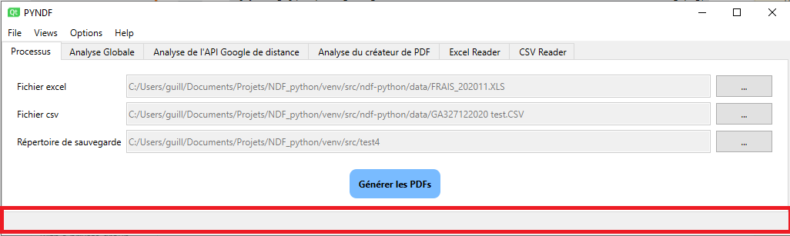
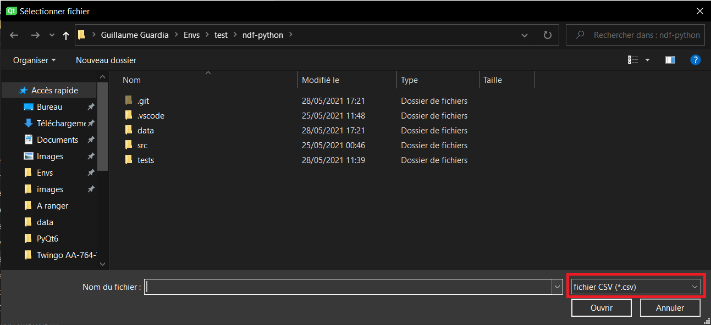

# Manuel de l'application NDF python

Sommaire:

1. **[Installation](#installation)**  

## Installation 

1.  [Télécharger python version 3.9.1](https://www.python.org/downloads/release/python-391/). Pour vérifier: 

2. [Télécharger git](https://git-scm.com/downloads). Pour vérifier:

3. Installation de la libraire d'environnement virtuel virtualenvwrapper-win via pip avec la commande "*pip install --user -U virtualenvwrapper-win*".

4. Création d'un environnement virtuel avec la commande "*mkvirtualenv nom_de_l'environnement*". 

 Le programme activera automatiquement l'environnement. 

5. Déplacement dans le répertoire de l'environnement virtuel avec la commande "*cdvirtualenv*". 

6. Récupération de dépôt git depuis github avec la commande "*git clone https://github.com/Guillaume-Guardia/ndf-python*" . 

7. Installation des dépendances liées au projet ndf-python avec la commande "*pip install -e .*"

8. TODO set NDF_ENV=name_env 

9. Créer un raccourci du fichier ndf.exe

## Lancer l'application

  Il existe manière de démarrer l'application:
  + Par la ligne de commande "*py src/pyndf/main.py [-h] [--log {NOTSET, DEBUG, INFO, WARN, ERROR, CRITICAL}] [-e EXCEL] [-c CSV] [-o OUTPUT] [-l LANGUAGE]*" à la racine du dépôt git. Il faut s'assurer d'avoir activer l'environnement virtuel avant d'exécuter la commande. Pour activer l'environnement virtuel, il suffit de lancer la commande "*workon nom_de_l'environnement*". Pour se rendre à la racine du dépôt git, taper la commande "*cdvirtualenv & cd ndf-python*".
Explications des arguments facultatifs optionnels:
    - -h, --help: Montre la liste des options.
    - --log {NOTSET,DEBUG,INFO,WARN,ERROR,CRITICAL}: Niveau des logs affichés
    - -e EXCEL, --excel EXCEL: Fichier Excel à utiliser
    - -c CSV, --csv CSV: Fichier CSV à utiliser
    - -o OUTPUT, --output OUTPUT: Le répertoire de sauvegarde
    - -l LANGUAGE, --language LANGUAGE: Sélection de la langue de l'application (en ou fr)
 - Par le fichier ndf.bat en double cliquant sur l'icone.
 - Par le fichier ndf.exe en double-cliquant sur l'icone.
 - En créant un raccourci sur le fichier ndf.bat ou ndf.exe, et en double cliquant dessus.
 
 L'ensemble des façons va ouvrir la fenêtre de l'application prête à être utiliser.

## Ergonomie

### Mise en mémoire des paramètres utilisateurs
L'application retient les choix de l'utilisateur entre deux sessions:
* la taille et la position de la fenêtre dans l'écran
* le chemin du fichier EXCEL
* le chemin du fichier CSV
* le chemin du répertoire de sauvegarde
* la couleur du tableau de fichier PDF
* la langue

La routine de mise en mémoire dans le pc intervient seulement lors d'une fermeture désirée (pas de crash).

## Interface graphique

L'interface est composée de vues (onglets), 

 et d'un menu 

. Chaque vue et sous-menu sont décrit dans les paragraphes suivants.

## Vues

Il existe trois types de vues existant:
* la vue de traitement, dont les fonctionnalités sont le choix des fichiers à utiliser, le choix du répertoire de sauvegarde, bouton de génération des fichiers PDF.
* les vues d'analyses (Globale, API, PDF), qui résument l'ensemble des traitements effectués au cours de la génération de fichiers PDF.
* les vues fichiers (EXCEL et CSV), qui sont un copier-coller des fichiers EXCEL et CSV mise à disposition.

Une barre de statuts se situant en bas de chaque vue a été ajouté, permettant de tenir informer l'utilisateur du déroulement du programme. Elle est divisée en deux partie: Une partie pour les messages envoyé depuis l'application, et une autre pour la barre de chargement avec un indicateur digital à sa droite. 

### La vue processus

Cette vue permet d'ajouter les fichiers EXCEL et CSV, mais aussi le répertoire de sauvegarde depuis l'explorateur natif de l'OS. Quand le fichier est ainsi saisi, on peut visualiser le chemin de ce fichier dans l'encadré. 

Des filtres ont été ajoutés pour plus de visibilités:
* Pour le fichier Excel -> \*.xl\* et \*. XLS
* Pour le fichier CSV -> \*.csv
  

)

  

### Vues d'analyse

  

Trois vues d'analyse ont été implémenté pour le moment. Dans chaque vue, on peut retrouver des similarités telles que le status (OK/ERROR/ou autre) et le temps d'exécution en secondes. Une ligne totale a été ajouté pour chaque vue d'analyse.

  

#### Analyse Globale

  

Les quatres processus décrits sont les deux readers EXCEL/CSV, le calcul de la distance recueilli par l'API Google, la DB ou bien le cache, et la création des PDFs.

  

#### Analyse de l'API Google Distance

  

Chaque ligne représente une ligne sélectionnée depuis le fichier d'excel (avec pour libellé INDEMNITE). Elle est composée des adresses de départ et d'arrivé du fichier excel et des adresses résultantes utilisées pour l'API google ou la DB ou le cache.

  

> Un jeu de couleur est défini:

> - Vert pour aucune différence

> - Orange pour quelques différences

> - Rouge si les deux adresses ne correspondent pas

  

Ces informations sont suivis de la distance, du status (OK/DB/CACHE si réussi) et du temps dépensé.

Il est alors facile de visualiser une erreur de l'application et de la rectifier rapidement.

  

#### Analyse du créateur de PDF

  

Comme les autres vues d'analyse, c'est un tableau descriptif des créations PDFs des notes de frais. De gauche à droite, on peut voir le nom du fichier tel que {AGENCE_DORIGIN}_{MATRICULE}_{AAAAMM}, le nombre de missions de l'employé, le status de la création (OK si réussi) et le temps pris pour l'exécution de l'exportation en pdf.

  

### Vues de lecture

  

Ce sont des tableaux représentatifs des fichiers excel et csv ouvert dans l'application. On peut donc apercevoir exactement la même chose qu'en ouvrant les documents dans Excel. Si une erreur est annoncée lors de l'exécution du programme, ces vues permettent de directement modifier le fichier ouvert, si une adresse est mal comprise par l'api Google. L'application va enregistrer la modification dans un fichier temporaire utilisable pour le processus de création de PDF. Dès la fermeture de l'application, ces fichiers temporaires sont détruits.

  

## Menu

  

Quelques fonctionnalités ont été ajoutés dans la barre de menu tout en haut.

  

### Fichier

  

Ce sous-menu permet d'effectuer les tâches suivantes:

* Sélection du fichier CSV, du fichier EXCEL, du répertoire de sauvegarde

* Génération des PDFs si tous les champs requis ont été rempli.

* Fermeture de l'application

  

### Vues

  

Ce sous-menu permet d'afficher/cacher les différent onglets rangés par fonctionnalités.

  

### Options

  

Ce sous-menu permet de choisir la langue de l'application. Cette fonction va redémarrer la fenêtre pour ainsi réinitialiser tous les labels, mais effacera toutes les données des vues d'analyses. Un color picker a été ajouté pour modifier la couleur du tableau dans le template de PDF.

  

### Help

  

Ce sous-menu est composé du manuel qui est directement lié au README.md du package.
